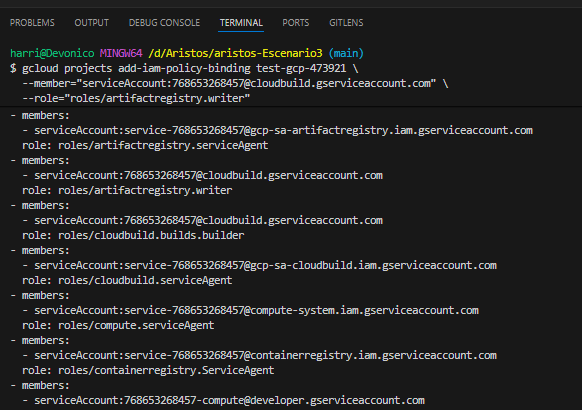
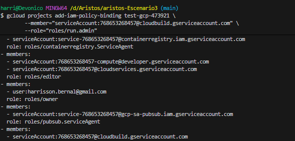
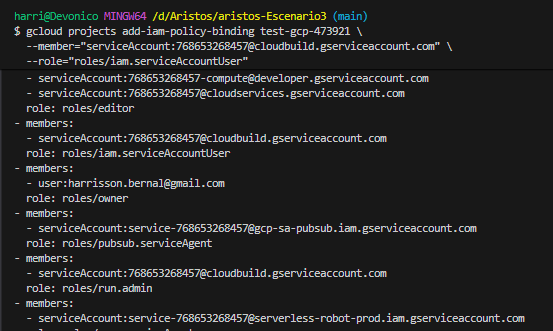
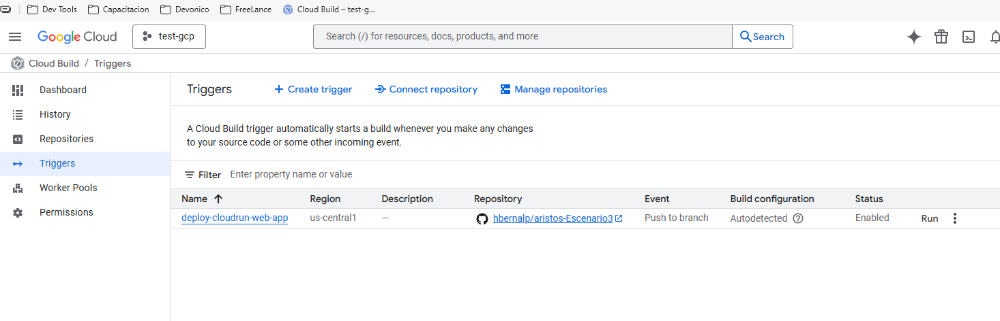

Con Base ne la solicitud, realizaremos un proyecto utilizando el proyecto test-gcp usado en el escenario2, para esto utilizamos el servicio de Google Cloud Build

El flujo a utilizar para ejecutar las actividades son los siguientes:

    - Preparar proyecto (APIs + Artifact Registry).
    - Crear la app simple (Flask), Dockerfile y cloudbuild.yaml.
    - Crear repo en GitHub y subir código.
    - Conceder permisos a la cuenta de Cloud Build.
    - Crear trigger en Cloud Build (conectar GitHub).
    - Hacer push a main → Cloud Build construye, sube la imagen y despliega a Cloud Run.
    - Verificar la URL del servicio y hacer pública la app.
    - Recolectar evidencias de manera transversal, mientras ejecuto la actividad.

Para el desarrollo del proyecto aprovecharemos las variables que ya tenemos

    Project ID: test-gcp-473921
    Project number: 768653268457
    Region: us-central1
    Cloud Run service name (ejemplo): cloudrun-web-app
    Artifact Registry repo (ejemplo): web-repo

1. Preparar proyecto

    1.1. Autenticar y configurar el proyecto

        Para esto utilizaremos los siguientes comandos:

            - gcloud auth login
            - gcloud config set project test-gcp-473921
            - gcloud config set run/region us-central1

    1.2. Habilitar las APIS necesarias, para los artefactos, el cloudbuil y el run, para esto se utiliza el siguiente comando:

        gcloud services enable cloudbuild.googleapis.com run.googleapis.com artifactregistry.googleapis.com

    1.3. Creando el repositorio Docker en Artifact Registry
        Para ello se hace uso del siguiente comando:
            gcloud artifacts repositories create web-repo --repository-format=docker --location=us-central1 --description="Repo Docker para Cloud Build / Cloud Run"

        se verifica que haya quedado creado el repositorio

            gcloud artifacts repositories list --location=us-central1

2. Creando la aplicación simple localmente

    Creo el directorio app, en el esta la app.py, el archivo yaml que se encargara de hacer el build de la aaplicacion, y el Dockerfile el cual hara la creacion del contenedor de la solucion con base en los datos delarchivo requirements.txt

3. Inicializo el Repo de Git, en GitHub para publicar y consumor la solucion y hacer el deploy

4. Dar permisos a la cuenta de Cloud Build
    
    Para asignar los permisos de a la cuenta de Cloud Build es necesario conceder los roles necesarios 
    
        Artifact Registry writer
        Cloud Run deployer
        ServiceAccountUser

    para poder asignarlos se ejecutan los siguientes comandos:

        gcloud projects add-iam-policy-binding test-gcp-473921 \
        --member="serviceAccount:768653268457@cloudbuild.gserviceaccount.com" \
        --role="roles/artifactregistry.writer"

        gcloud projects add-iam-policy-binding test-gcp-473921 \
        --member="serviceAccount:768653268457@cloudbuild.gserviceaccount.com" \
        --role="roles/run.admin"

        gcloud projects add-iam-policy-binding test-gcp-473921 \
        --member="serviceAccount:768653268457@cloudbuild.gserviceaccount.com" \
        --role="roles/iam.serviceAccountUser"

    Estos roles permiten que Cloud Build suba imágenes y despliegue en Cloud Run

5. Crear trigger en Cloud Build 
    
    En la consola web se ingresa a Cloud build y se crean los triger correspondientes:

    